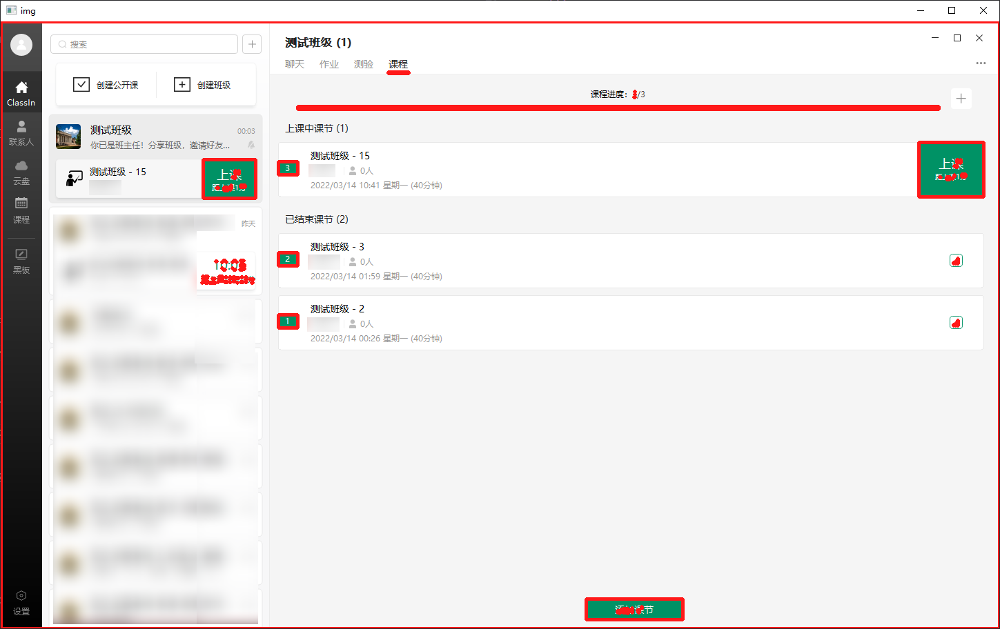
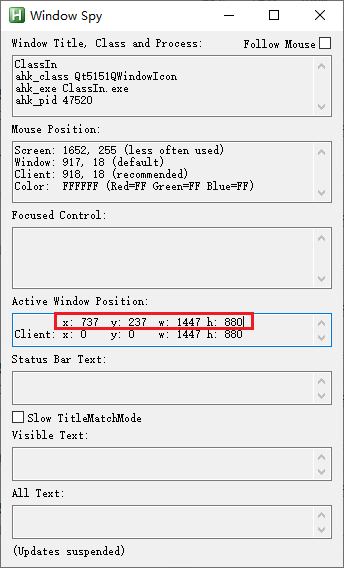

# ClassIn 自动打卡

<div align="center">
	<p>犯我睡眠者，虽远必诛！😅</p>
	<p>早八，生不如死！</p>
</div>

## 流程

简要介绍一下这个工具的流程。

1. 本工具直接写死，是死循环，不断检测是否上课，直到开始上课。
2. 主循环体内通过 win32api 或取 ClassIn 窗口截图，然后使用 OpenCV 进行判断是否存在上课按钮。
3. 因为用的是 win32api，macOS 用户请自行出门左转。不过这里给一个解决之道：两年前的晓黑板网课我写过 OSAScript 结合 Java 的 Robot 类实现控制，有兴趣的可以自己实现一下。若有精力，甚至可以去查一下 OSX 的 API，相信肯定大有用处。

下图为识别演示（使用过程中不会出现）

<div align="center">
	</img>
</div>

## 使用

命令行：

```
> python .\cli.py start-daemon --help
Usage: cli.py start-daemon [OPTIONS]

  start daemon

Options:
  --hwnd INTEGER   Window handle
  --delay INTEGER  Delay (second) between screenshots
  --help           Show this message and exit.
```

可以提供两个可选参数。

* `hwnd`: ClassIn 窗体句柄。关于获取句柄在文后会详述。
* `delay`: 检测间隔时间

## 获取窗体句柄

日后可能会写自动获取句柄，但是到底写不写就两说了，~~毕竟能用就行~~。

ClassIn 这个软件非常的离谱。一个窗体对应着 **若干个** 窗体句柄，并且都是同一个进程号，而且剩余的几个窗口都是不可视的。我也是无力吐槽，这个点耗费了我一个小时。

那怎么解决呢？不用慌，暴力出奇迹。

我写了 `fuck_classin.cpp`，其可以列出系统中的所有窗体句柄。我是用 `DevC++` (对，我就是懒，我就用它) 编译了一个 64 位（应该是，不太确定）的版本，放在 `binary/fuck_classin.exe`。由于是命令行无法直接使用，所以我还写了一个 batch 脚本，请运行 `print_hwnd.bat`。结果会输出到 `test.out`。

得到结果后，大家只要善用搜索，找到 `WindowName` 为 `ClassIn`，`ClassName` 为 `Qt5151QWindowIcon`，且 `RECT` 值与窗体实际相匹配的 `HWND` 即可。

注: `RECT` 的四个值分别是 `left, right, top, bottom`。想要获取某个窗口的位置可以通过 `AutoHotKey` 的 `WindowSpy` 工具，微软提供的 `Spy++`, `UISpy` 等。这里不多做详述。

然后我们就能获得 **十六进制** 的 `HWND`。接下来你只需要将其转换为 **十进制**，然后用命令行传给脚本即可。

下图为使用 `Window Spy` 获取窗体的位置。

<div align="center">
	</img>
</div>
